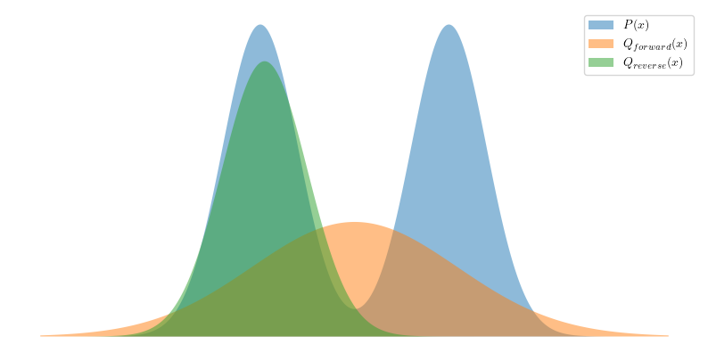

The **Kullback–Leibler (KL) divergence**, denoted as $D_\text{KL}(P \parallel Q)$, is a statistical distance that measures how one probability distribution $P$ is different from a second, reference probability distribution $Q$. Usually, $P$ represents the **actual distribution** and $Q$ represents a model or approximation.

## Definition

For discrete probability distributions, the KL divergence is defined as

$$
D_\text{KL}(P \parallel Q) = \sum_{x \in \mathcal{X}} P(x) \log\left(\frac{P(x)}{Q(x)}\right)\ .
$$

For continuous probability distributions, the KL divergence is defined as

$$
D_\text{KL}(P \parallel Q) = \int_{-\infty}^\infty p(x) \log\left(\frac{p(x)}{q(x)}\right) \mathrm{d}x\ ,
$$

where $p$ and $q$ denote the probability densities of $P$ and $Q$.

## Forward KL vs. Reverse KL

Eric Jang has a great explanation in his [post](https://blog.evjang.com/2016/08/variational-bayes.html). Take an example for a better understanding. Suppose the true distribution is the addition of two Gaussian distributions as

$$
P(x) = f(x \mid -3, 1.2^2) + f(x \mid 3, 1.2^2)\ ,
$$

and the approximation model is a single Gaussian distribution as

$$
Q(x) = f(x \mid \mu, \sigma^2)\ .
$$

The `scipy` package is used for the minimization of KL value starting from $\mu = -3$ and $\sigma = 1.2$. With forward KL

```python
import numpy as np
from scipy.optimize import minimize
from scipy.stats import norm, entropy

def objective(x):
    x_axis = np.arange(-10, 10, 0.01)
    q = norm.pdf(x_axis, x[0], x[1])
    p = norm.pdf(x_axis, -3, 1.2) + norm.pdf(x_axis, 3, 1.2)
    return entropy(p, q)

result = minimize(objective, [-3, 1.2], method='L-BFGS-B')

# summarize the result
print('Status : %s' % result['message'])
print('Total Evaluations: %d' % result['nfev'])
# evaluate solution
solution = result['x']
evaluation = objective(solution)
print('Solution: f(%s) = %.5f' % (solution, evaluation))
```

we have

```text
Status : CONVERGENCE: NORM_OF_PROJECTED_GRADIENT_<=_PGTOL
Total Evaluations: 39
Solution: f([1.17480310e-04 3.26838899e+00]) = 0.31247
```

With reverse KL

```python
import numpy as np
from scipy.optimize import minimize
from scipy.stats import norm, entropy


# reverse
def objective(x):
    x_axis = np.arange(-10, 10, 0.01)
    q = norm.pdf(x_axis, x[0], x[1])
    p = norm.pdf(x_axis, -3, 1.2) + norm.pdf(x_axis, 3, 1.2)
    return entropy(q, p)

result = minimize(objective, [-3, 1.2], method='L-BFGS-B')

# summarize the result
print('Status : %s' % result['message'])
print('Total Evaluations: %d' % result['nfev'])
# evaluate solution
solution = result['x']
evaluation = objective(solution)
print('Solution: f(%s) = %.5f' % (solution, evaluation))
```

we have

```text
Status : CONVERGENCE: NORM_OF_PROJECTED_GRADIENT_<=_PGTOL
Total Evaluations: 21
Solution: f([-2.86330876  1.36375868]) = 0.66646
```

Rewrite the solution in the standard form we have

$$
Q_{\text{forward}}(x) = f(x \mid 1.175 \times 10^{-4}, 3.268^2)\ ,
$$

and

$$
Q_{\text{reverse}}(x) = f(x \mid -2.863, 1.364^2)\ .
$$

Plot $P(x)$ and both $Q(x)$ with

```python
import matplotlib.pyplot as plt
import numpy as np
from scipy.stats import norm

plt.rcParams['text.usetex'] = True

x = np.arange(-10, 10, 0.01)
p = norm.pdf(x, -3, 1.2) + norm.pdf(x, 3, 1.2)
q_forward = norm.pdf(x, 1.175e-4, 3.268)
q_reverse = norm.pdf(x, -2.863, 1.36)

fig, ax = plt.subplots(1, 1, figsize=(10,5))
ax: plt.Axes
ax.fill_between(x, p, alpha=.5, label=r'$P(x)$')
ax.fill_between(x, q_forward, alpha=.5, label=r'$Q_{forward}(x)$')
ax.fill_between(x, q_reverse, alpha=.5, label=r'$Q_{reverse}(x)$')
ax.axis('off')
ax.legend()
```

we have



and the values of KL divergence are

$$
\begin{aligned}
D_\text{KL}(P \parallel Q_{forward}) &= 0.31247 \\
D_\text{KL}(P \parallel Q_{reverse}) &= 3.98727 \\
D_\text{KL}(Q_{forward} \parallel p) &= 0.51217 \\
D_\text{KL}(Q_{reverse} \parallel p) &= 0.66647
\end{aligned}
$$

It can be shown from this plot and calculation of KL values that $Q_{reverse}$ can be viewed as the local minimum under the reverse KL schema and depending on the optimization starting point. While under the forward KL schema, $Q_{reverse}$ can never be achieved due to the penalty of $P$ in non-zero areas. Therefore, if our goal is to narrow the distance between $Q$ and $P$ where $Q$ is not zero, it's better to use reverse KL divergence.
