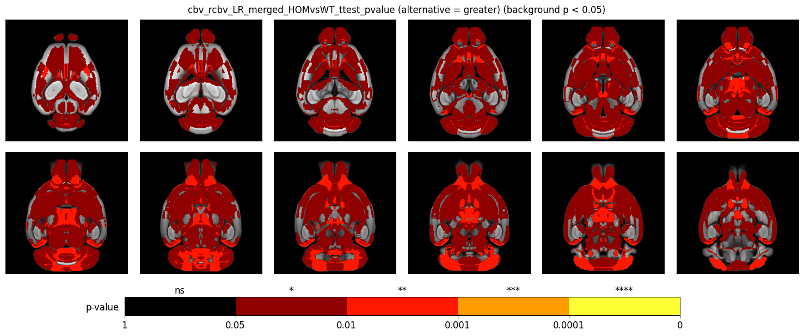

```python
from pathlib import Path

import matplotlib as mpl
import matplotlib.pyplot as plt
import nibabel as nib
import numpy as np

cmap = mpl.colors.ListedColormap([[0, 0, 0, 0], plt.cm.hot(0.2), plt.cm.hot(0.4), plt.cm.hot(0.6), plt.cm.hot(0.8)], N=5)
for p in Path('./results/').glob('*/*_pvalue.nii.gz'):
    pvalue = nib.load(p).get_fdata()
    label = np.zeros(pvalue.shape, dtype=np.uint8)
    label[pvalue <= 0.05] = 1
    label[pvalue <= 0.01] = 2
    label[pvalue <= 0.001] = 3
    label[pvalue <= 0.0001] = 4
    label = np.rot90(label, axes=(0, 1))
    label = np.flip(label, axis=2)
    bg_bias = False
    if label[annot==0].flatten()[0] > 0:
        bg_bias = True
    label[annot==0] = 0
    for i in range(5):
        print(np.sum(label == i))

    label = cmap(label)

    fig, axs = plt.subplots(2, 6, figsize=(15, 7))
    plt.tight_layout(pad=0, h_pad=0, w_pad=0)
    plt.subplots_adjust(wspace=.1, hspace=-.4)
    for idx, slc_idx in enumerate(np.linspace(30, 85, 12, dtype=np.int64)):
        c, r = np.unravel_index(idx, (2, 6))
        ax: plt.Axes = axs[c][r]
        ax.imshow(template[:, :, slc_idx], cmap='gray')
        ax.imshow(label[:, :, slc_idx])
        ax.axis('off')
    name = p.name.replace('.nii.gz', '')
    alternative = p.parent.name

    if bg_bias:
        plt.suptitle(f'{name} (alternative = {alternative}) (background p < 0.05)', y=.89, fontsize='large')
    else:
        plt.suptitle(f'{name} (alternative = {alternative})', y=.89, fontsize='large')
    cbar = fig.colorbar(
        mappable=plt.cm.ScalarMappable(
            norm=None,
            cmap=cmap
        ), ax=axs[1, :], location='bottom', shrink=.7, aspect=30, pad=0.1)
    cbar.set_ticks(ticks=[0, .2, .4, .6, .8, 1], labels=['1', '0.05', '0.01', '0.001', '0.0001', '0'])
    cbar.set_ticks(ticks=[.1, .3, .5, .7, .9], labels=['ns', '*', '**', '***', '****'], minor=True, y=.85)
    cbar.ax.tick_params(axis='x', which='minor', bottom=False, labeltop=True, labelbottom=False)
    cbar.ax.tick_params(axis='both', which='both', labelsize='large')
    cbar.ax.set_ylabel('p-value', rotation=0, fontsize='large')
    cbar.ax.yaxis.set_label_coords(-.04, 0.15)
    fig.savefig(f'./results/{alternative}/{name}.png', bbox_inches='tight', pad_inches=0)
    display(plt.gcf())
    plt.close()
```

example image:


