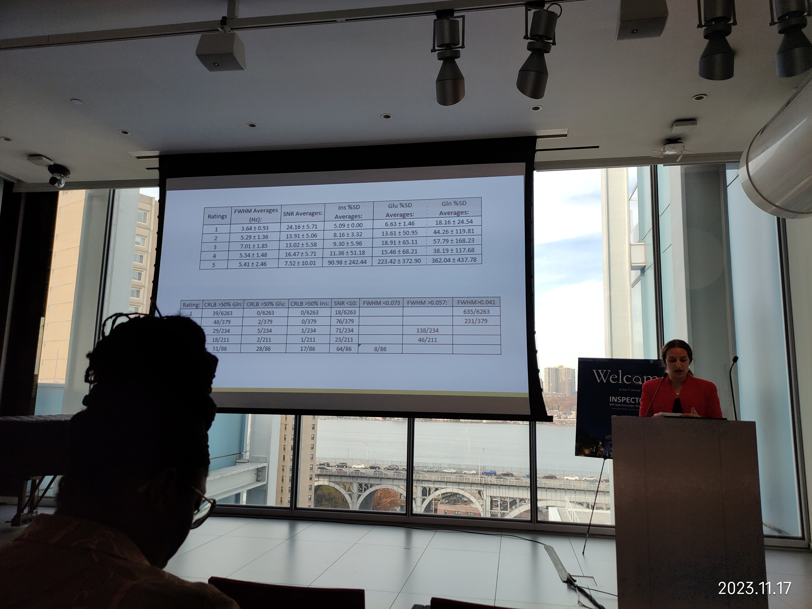
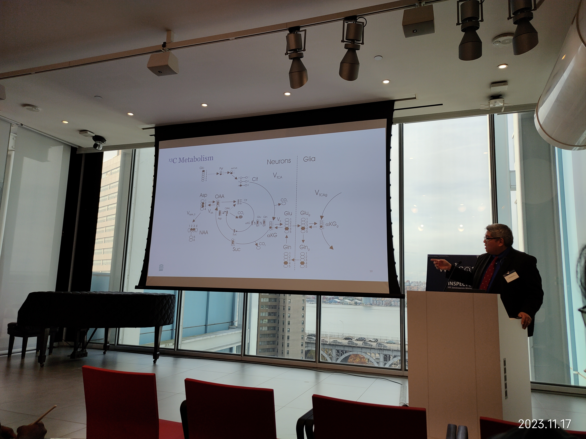
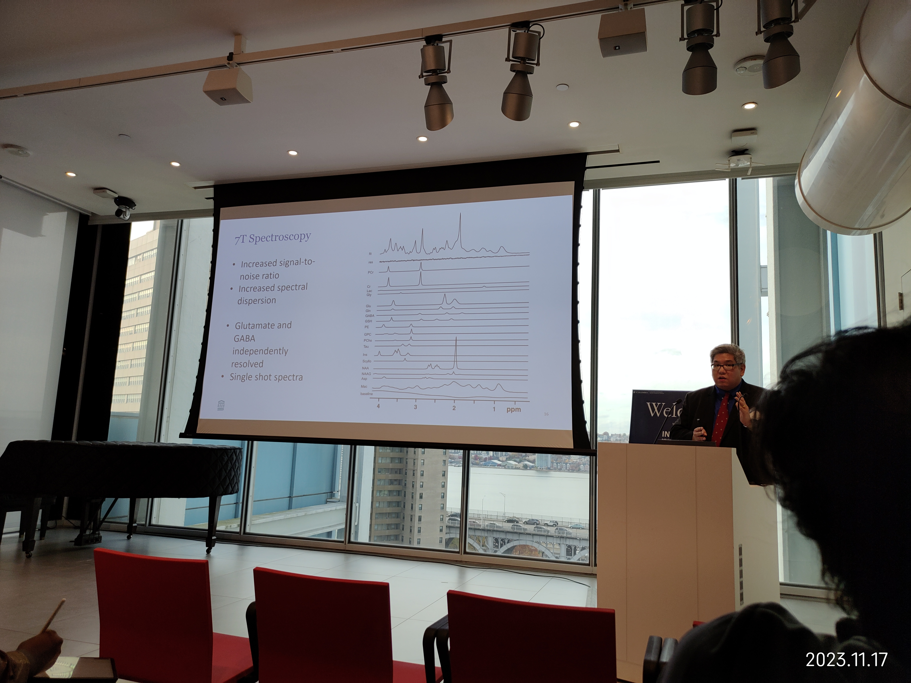
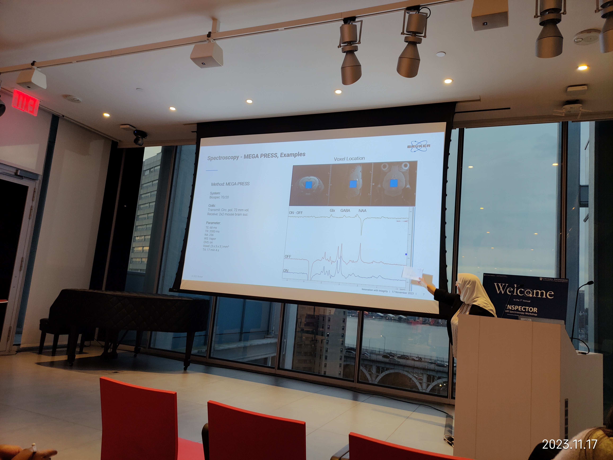

Website: <https://juchem.bme.columbia.edu/content/7th-annual-inspector-workshop>

Speaker List: <https://juchem.bme.columbia.edu/sites/default/files/content/INSPECTOR_workshop_program_2023.pdf>

Deep Learning-based MRS Reconstruction and Denoising with Artificial Fourier Transform Network (AFT-Net) \
*Yanting Yang, M.S., Columbia University*

A complex-valued deep learning framework - artificial Fourier transform network (AFT-Net), which directly processes the complex-value raw data in the sensor domain, is proposed to reconstruct spectra from FIDs and denoise the spectra in parallel. We trained the model on the simulated MEGA-PRESS dataset and the in-vivo Big GABA dataset. An evaluation of different acceleration rates was performed on the in-vivo dataset. AFT-Net demonstrated the ability to reconstruct the data with high fidelity and significantly accelerate acquisition. The proposed AFT-Net is an efficient and accurate approach for MRS spectra reconstruction from raw data. \
[slides](./slides.pptx) | [speaker notes](./speaker-notes.docx)

Presenting.

Metrics.

$^{13}\text{C}$ Metabolism.

Metabolite spectra under 7T.

MEGAPRESS parameters.
